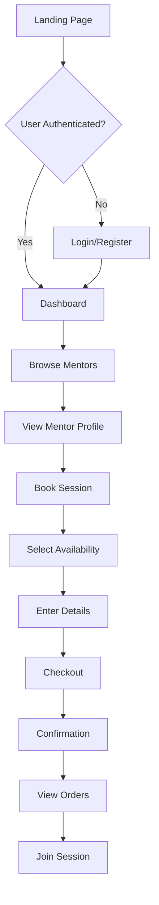
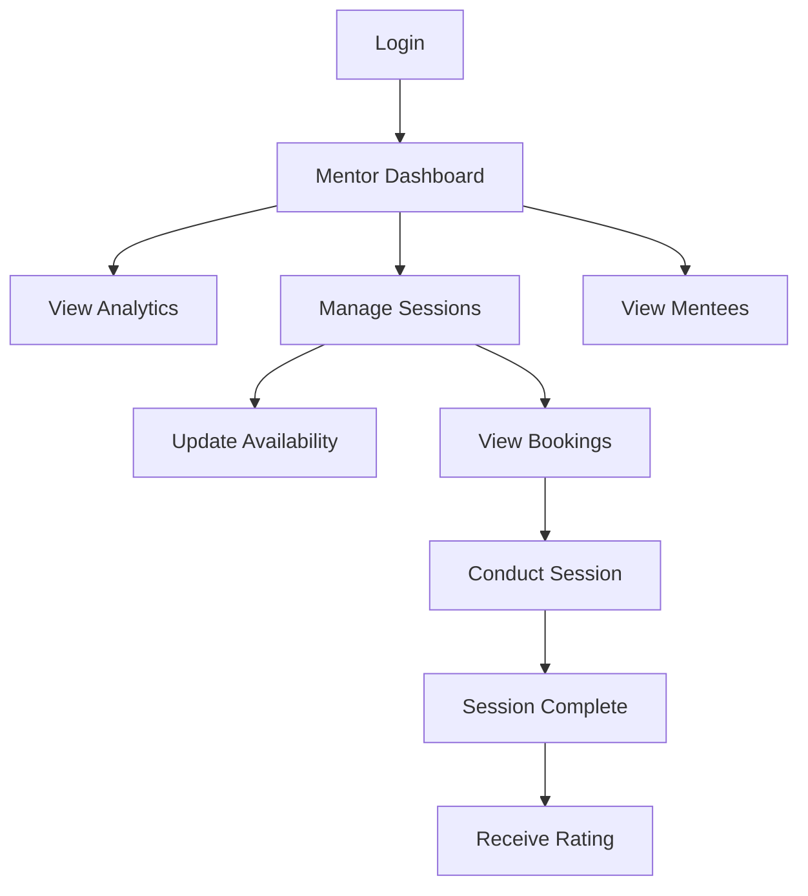

# SkillSwap - Mentor-Mentee Platform

A comprehensive Angular-based web application that connects mentors and mentees for skill-sharing sessions. This platform enables users to browse mentors, book sessions, manage their learning journey, and earn rewards through referrals.

## 📋 Table of Contents

- [Project Overview](#project-overview)
- [Features](#features)
- [Technology Stack](#technology-stack)
- [Project Structure](#project-structure)
- [Installation & Setup](#installation--setup)
- [Application Workflow](#application-workflow)
- [Module Architecture](#module-architecture)
- [Authentication System](#authentication-system)
- [Key Components](#key-components)
- [Services](#services)
- [Routing](#routing)
- [Development Guidelines](#development-guidelines)
- [Testing](#testing)
- [Build & Deployment](#build--deployment)

---

## 🎯 Project Overview

**SkillSwap** is a modern mentorship platform built with Angular 15 that facilitates knowledge sharing between experienced professionals (mentors) and learners (mentees). The platform provides a seamless experience for:

- **Mentees**: Browse mentors, book sessions, track learning progress
- **Mentors**: Manage sessions, view analytics, track earnings
- **Admins**: Oversee platform operations and user management

---

## ✨ Features

### Core Features
- 🔐 **Authentication & Authorization** - Secure login/registration with role-based access control
- 👥 **User Roles** - Support for Mentee, Mentor, and Admin roles
- 📅 **Session Booking** - Multi-step booking flow with availability picker
- 💬 **Messaging System** - Real-time communication between users
- 🎫 **Referral Program** - Earn golden tickets by referring friends
- 📊 **Analytics Dashboard** - Comprehensive metrics and insights
- 🤖 **AI Chatbot** - Intelligent assistant for user support
- 🎨 **Theme Support** - Light/dark mode toggle

### User Features
- Browse mentor profiles with detailed information
- Filter mentors by skills, ratings, and availability
- Book sessions with real-time availability checking
- View and manage session orders
- Track learning progress and statistics
- Earn and redeem golden tickets

### Mentor Features
- Dedicated mentor dashboard with session analytics
- Manage availability and pricing
- View mentee information and session history
- Track earnings and performance metrics
- Rebook management system

### Admin Features
- Platform-wide analytics and reporting
- User management and moderation
- System configuration and settings

---

## 🛠 Technology Stack

### Frontend
- **Framework**: Angular 15.2.0
- **Language**: TypeScript 4.9.4
- **Styling**: CSS3 with custom design system
- **State Management**: RxJS 7.8.0
- **HTTP Client**: Angular HttpClient
- **Routing**: Angular Router with lazy loading

### Development Tools
- **CLI**: Angular CLI 15.2.11
- **Build Tool**: Angular DevKit
- **Testing**: Jasmine & Karma
- **Version Control**: Git

---

## 📁 Project Structure

```
Demo/
├── src/
│   ├── app/
│   │   ├── admin/                    # Admin module
│   │   │   ├── admin.component.ts
│   │   │   └── admin.module.ts
│   │   │
│   │   ├── auth/                     # Authentication module
│   │   │   ├── auth.guard.ts         # Route protection
│   │   │   ├── auth.interceptor.ts   # HTTP interceptor
│   │   │   ├── auth.service.ts       # Auth logic
│   │   │   ├── login.component.ts
│   │   │   ├── register.component.ts
│   │   │   └── auth.module.ts
│   │   │
│   │   ├── booking/                  # Session booking module
│   │   │   ├── availability/         # Availability picker
│   │   │   ├── details/              # Booking details form
│   │   │   ├── checkout/             # Payment & confirmation
│   │   │   ├── booking.component.ts
│   │   │   └── booking.module.ts
│   │   │
│   │   ├── chatbot/                  # AI chatbot module
│   │   │   ├── chatbot.component.ts
│   │   │   └── chatbot.module.ts
│   │   │
│   │   ├── core/                     # Core utilities
│   │   │
│   │   ├── dashboard/                # User dashboard module
│   │   │   ├── mentee/               # Mentee-specific dashboard
│   │   │   ├── mentor/               # Mentor-specific dashboard
│   │   │   ├── orders/               # Order management
│   │   │   ├── referral-modal/       # Referral invitation modal
│   │   │   ├── dashboard.component.ts
│   │   │   └── dashboard.module.ts
│   │   │
│   │   ├── messages/                 # Messaging module
│   │   │   ├── messages.component.ts
│   │   │   └── messages.module.ts
│   │   │
│   │   ├── public/                   # Public pages module
│   │   │   ├── about/                # About page
│   │   │   ├── landing/              # Home/landing page
│   │   │   ├── mentors/              # Mentor listing & profiles
│   │   │   ├── pricing/              # Pricing information
│   │   │   ├── public.component.ts
│   │   │   └── public.module.ts
│   │   │
│   │   ├── referral/                 # Referral system module
│   │   │   └── referral.module.ts
│   │   │
│   │   ├── services/                 # Shared services
│   │   │   ├── referral.service.ts   # Referral logic
│   │   │   └── theme.service.ts      # Theme management
│   │   │
│   │   ├── shared/                   # Shared components
│   │   │   ├── components/
│   │   │   │   └── toast.component.ts
│   │   │   └── shared.module.ts
│   │   │
│   │   ├── app-routing.module.ts     # Main routing configuration
│   │   ├── app.component.ts          # Root component
│   │   └── app.module.ts             # Root module
│   │
│   ├── assets/                       # Static assets
│   ├── index.html                    # Main HTML file
│   ├── main.ts                       # Application entry point
│   └── styles.css                    # Global styles
│
├── angular.json                      # Angular configuration
├── package.json                      # Dependencies
├── tsconfig.json                     # TypeScript configuration
└── README.md                         # This file
```

---

## 🚀 Installation & Setup

### Prerequisites
- Node.js (v14.x or higher)
- npm (v6.x or higher)
- Angular CLI 15.2.11

### Installation Steps

1. **Clone the repository**
   ```bash
   git clone <repository-url>
   cd Demo
   ```

2. **Install dependencies**
   ```bash
   npm install
   ```

3. **Start development server**
   ```bash
   npm start
   # or
   ng serve
   ```

4. **Access the application**
   ```
   Navigate to: http://localhost:4200/
   ```

### Default Login Credentials
For testing purposes, use:
- **Email**: `admin@gmail.com`
- **Password**: `12345678`
- **Roles**: Admin, Mentor, User

---

## 🔄 Application Workflow

### 1. User Journey - Mentee



### 2. User Journey - Mentor



### 3. Booking Flow (3-Step Process)

**Step 1: Availability Picker**
- User selects mentor
- Views available time slots
- Chooses preferred date/time
- Data stored in sessionStorage

**Step 2: Booking Details**
- Displays mentor information (read-only)
- Shows pricing details
- User enters personal information
- Form validation
- Data stored in sessionStorage

**Step 3: Checkout**
- Review booking summary
- Mentor details (read-only)
- Pricing breakdown
- Payment processing
- Confirmation & order creation

---

## 🏗 Module Architecture

### Lazy Loading Strategy

The application uses lazy loading for optimal performance:

```typescript
// app-routing.module.ts
const routes: Routes = [
  { 
    path: '', 
    loadChildren: () => import('./public/public.module').then(m => m.PublicModule) 
  },
  { 
    path: 'auth', 
    loadChildren: () => import('./auth/auth.module').then(m => m.AuthModule) 
  },
  { 
    path: 'dashboard', 
    loadChildren: () => import('./dashboard/dashboard.module').then(m => m.DashboardModule),
    canLoad: [AuthGuard],
    canActivate: [AuthGuard]
  },
  // ... other routes
];
```

### Module Breakdown

#### 1. **Public Module**
- Landing page
- About page
- Mentor listing
- Mentor profiles
- Pricing information
- Accessible without authentication

#### 2. **Auth Module**
- Login component
- Registration component
- Auth service
- Auth guard
- Auth interceptor

#### 3. **Dashboard Module**
- Main dashboard component
- Mentee dashboard
- Mentor dashboard
- Orders management
- Referral modal
- Protected by AuthGuard

#### 4. **Booking Module**
- Availability picker
- Booking details form
- Checkout process
- Multi-step workflow

#### 5. **Messages Module**
- User messaging
- Real-time communication
- Protected routes

#### 6. **Admin Module**
- Admin dashboard
- User management
- Platform analytics
- Role-based access (admin only)

#### 7. **Chatbot Module**
- AI-powered assistant
- User support
- FAQ handling

---

## 🔐 Authentication System

### Auth Service

The `AuthService` manages user authentication and session persistence:

```typescript
// Key Features:
- Login with email/password
- Session persistence (localStorage)
- JWT token management
- User state management (BehaviorSubject)
- Token refresh mechanism
- Logout functionality
```

### Auth Guard

Protects routes requiring authentication:

```typescript
// Usage:
canLoad: [AuthGuard]      // Prevents module loading
canActivate: [AuthGuard]  // Prevents route activation
```

### Auth Interceptor

Automatically adds JWT tokens to HTTP requests:

```typescript
// Functionality:
- Intercepts outgoing requests
- Adds Authorization header
- Handles token refresh
- Error handling (401/403)
```

### User Roles

The system supports three roles:
1. **User/Mentee** - Basic user privileges
2. **Mentor** - Can conduct sessions, view analytics
3. **Admin** - Full platform access

---

## 🧩 Key Components

### 1. Dashboard Component

**Location**: `src/app/dashboard/dashboard.component.ts`

**Features**:
- Role-based view switching (Mentor/Mentee)
- Quick action cards
- Summary statistics
- Weekly session charts
- User highlights
- Session roadmap
- Leaderboards (Mentor & Mentee)
- Visit statistics
- Monthly session trends

**Key Data**:
```typescript
summaryCards = [
  { title: 'Active Mentors', value: 32, delta: '+4.2%' },
  { title: 'Active Mentees', value: 118, delta: '+2.8%' },
  { title: 'Sessions This Week', value: 54, delta: '+6.0%' },
  { title: 'Avg. Mentor Rating', value: '4.9', delta: '+0.3' }
];
```

### 2. Mentor Components

**Mentors List** (`mentors.component.ts`)
- Browse all mentors
- Filter by skills/ratings
- Search functionality
- Navigate to profiles

**Mentor Profile** (`mentor-profile.component.ts`)
- Detailed mentor information
- Skills and expertise
- Ratings and reviews
- Book session button
- Dynamic routing (by mentor ID)

### 3. Booking Components

**Availability Picker**
- Calendar view
- Time slot selection
- Real-time availability
- Data persistence

**Booking Details**
- Form validation
- User information collection
- Read-only mentor/pricing display
- Session storage integration

**Checkout**
- Order summary
- Payment processing
- Confirmation handling
- Toast notifications

### 4. Orders Component

**Location**: `src/app/dashboard/orders/orders.component.ts`

**Features**:
- View all bookings
- Filter by status
- Session details
- Cancellation handling

### 5. Referral Modal

**Location**: `src/app/dashboard/referral-modal/referral-modal.component.ts`

**Features**:
- Generate referral link
- Invite friends via email
- Track golden tickets
- Copy link functionality

---

## 🔧 Services

### 1. AuthService

**Location**: `src/app/auth/auth.service.ts`

**Responsibilities**:
- User authentication
- Session management
- Token handling
- User state broadcasting

**Key Methods**:
```typescript
login(email, password): Observable<{accessToken, user}>
logout(): void
setAccessToken(token): void
getAccessToken(): string | null
refreshAccessToken(): Observable<{accessToken, user?}>
currentUser$: Observable<User | null>
isAuthenticated: boolean
```

### 2. ReferralService

**Location**: `src/app/services/referral.service.ts`

**Responsibilities**:
- Generate referral links
- Send invitations
- Manage golden tickets
- Track referrals

**Key Methods**:
```typescript
getReferralLink(userId): string
inviteFriend(email): Observable<boolean>
```

### 3. ThemeService

**Location**: `src/app/services/theme.service.ts`

**Responsibilities**:
- Theme switching (light/dark)
- Theme persistence
- CSS variable management

### 4. ToastService

**Location**: `src/app/shared/components/toast.component.ts`

**Responsibilities**:
- Display notifications
- Success/error messages
- Auto-dismiss functionality

---

## 🛣 Routing

### Route Configuration

```typescript
// Main Routes
/                    → Landing page (Public)
/auth/login          → Login page
/auth/register       → Registration page
/mentors             → Mentor listing
/mentors/:id         → Mentor profile
/booking             → Session booking
/dashboard           → User dashboard (Protected)
/dashboard/orders    → Order management (Protected)
/messages            → Messaging (Protected)
/admin               → Admin panel (Admin only)
/chatbot             → AI chatbot
```

### Route Guards

**AuthGuard** - Protects authenticated routes:
```typescript
{ 
  path: 'dashboard', 
  canLoad: [AuthGuard], 
  canActivate: [AuthGuard] 
}
```

**Role-based Guards**:
```typescript
{ 
  path: 'admin', 
  canLoad: [AuthGuard], 
  data: { roles: ['admin'] } 
}
```

### Navigation Features

- **Scroll Position Restoration**: Automatically scrolls to top on route change
- **Initial Navigation**: Enabled blocking for SSR compatibility
- **Fragment Navigation**: Supports anchor links (e.g., #referral)

---

## 💻 Development Guidelines

### Code Scaffolding

Generate new components:
```bash
ng generate component component-name
ng generate directive|pipe|service|class|guard|interface|enum|module
```

### Component Structure

Follow this pattern:
```typescript
import { Component } from '@angular/core';

@Component({
  selector: 'app-component-name',
  templateUrl: './component-name.component.html',
  styleUrls: ['./component-name.component.css']
})
export class ComponentNameComponent {
  // Properties
  // Constructor
  // Lifecycle hooks
  // Methods
}
```

### Service Pattern

```typescript
import { Injectable } from '@angular/core';

@Injectable({ providedIn: 'root' })
export class ServiceName {
  constructor(private http: HttpClient) { }
  
  // Service methods
}
```

### State Management

Use RxJS BehaviorSubject for state:
```typescript
private state$ = new BehaviorSubject<State>(initialState);
public readonly state = this.state$.asObservable();
```

### HTTP Interceptor

All HTTP requests automatically include:
- Authorization header (JWT token)
- Error handling
- Token refresh logic

---

## 🧪 Testing

### Unit Tests

Run unit tests:
```bash
npm test
# or
ng test
```

**Test Framework**: Jasmine  
**Test Runner**: Karma

### Test Coverage

Generate coverage report:
```bash
ng test --code-coverage
```

### E2E Tests

```bash
ng e2e
```

*Note: E2E testing package needs to be added first*

---

## 📦 Build & Deployment

### Development Build

```bash
npm run build
# or
ng build
```

**Output**: `dist/skill-swap/`

### Production Build

```bash
ng build --configuration production
```

**Optimizations**:
- Ahead-of-Time (AOT) compilation
- Tree shaking
- Minification
- Output hashing
- Bundle optimization

### Build Configurations

**Development**:
- Source maps enabled
- No optimization
- Vendor chunk separation

**Production**:
- Full optimization
- Output hashing
- Budget limits:
  - Initial: 500KB (warning), 1MB (error)
  - Component styles: 10KB (warning), 20KB (error)

### Watch Mode

Continuous build during development:
```bash
npm run watch
# or
ng build --watch --configuration development
```

---

## 📊 Key Features Breakdown

### 1. Session Booking System

**Workflow**:
1. User browses mentors
2. Selects mentor profile
3. Clicks "Book Session"
4. **Step 1**: Picks available time slot
5. **Step 2**: Enters booking details
6. **Step 3**: Reviews and confirms checkout
7. Receives confirmation
8. Session appears in "Orders"

**Data Flow**:
- Uses `sessionStorage` for multi-step data persistence
- Validates each step before proceeding
- Displays read-only mentor/pricing info in steps 2 & 3

### 2. Referral System

**How it works**:
1. User receives golden tickets (initial: 3)
2. Opens referral modal from dashboard
3. Generates unique referral link
4. Invites friends via email
5. Spends 1 golden ticket per invitation
6. Earns rewards when referrals sign up

**Implementation**:
- Referral link format: `{origin}/register?ref={userId}`
- Golden tickets tracked in user object
- Optimistic UI updates

### 3. Dashboard Analytics

**Mentee View**:
- Active mentors count
- Sessions booked
- Learning progress
- Upcoming sessions
- Mentor recommendations

**Mentor View**:
- Sessions conducted
- Rebook rate
- Earnings
- Mentee statistics
- Performance metrics

**Toggle Feature**:
- Users with mentor role can switch views
- `viewAsMentor` flag controls display

### 4. Role-Based Access

**User Roles**:
```typescript
interface User {
  id: string;
  email: string;
  name: string;
  roles: string[];  // ['user', 'mentor', 'admin']
  goldenTickets: number;
}
```

**Access Control**:
- Public routes: Accessible to all
- Protected routes: Require authentication
- Admin routes: Require admin role
- Conditional UI: Based on user roles

---

## 🎨 Styling & Theming

### Global Styles

**Location**: `src/styles.css`

### Component Styles

Each component has its own CSS file:
- Scoped to component
- No style leakage
- Modular and maintainable

### Theme Service

Supports light/dark mode:
```typescript
toggleTheme(): void
getCurrentTheme(): 'light' | 'dark'
```

---

## 🔍 Debugging & Troubleshooting

### Common Issues

**1. Module not found**
```bash
npm install
```

**2. Port already in use**
```bash
ng serve --port 4201
```

**3. Build errors**
```bash
# Clear cache
rm -rf node_modules package-lock.json
npm install
```

**4. Authentication issues**
- Check localStorage for tokens
- Verify AuthGuard configuration
- Check interceptor implementation

### Browser DevTools

- **Console**: Check for errors
- **Network**: Monitor HTTP requests
- **Application**: Inspect localStorage/sessionStorage
- **Angular DevTools**: Component tree & state

---

## 📝 Environment Configuration

### Development
- API endpoint: Mock services
- Debug mode: Enabled
- Source maps: Enabled

### Production
- API endpoint: Production server
- Debug mode: Disabled
- Optimizations: Enabled

*Note: Environment files not currently configured. Add `src/environments/` for API configuration.*

---

## 🤝 Contributing

### Workflow
1. Create feature branch
2. Make changes
3. Test thoroughly
4. Submit pull request
5. Code review
6. Merge to main

### Coding Standards
- Follow Angular style guide
- Use TypeScript strict mode
- Write meaningful commit messages
- Add comments for complex logic
- Update documentation

---

## 📄 License

This project is part of the MEAN Stack learning curriculum.

---

## 👥 Support

For issues or questions:
- Check existing documentation
- Review conversation history
- Contact development team

---

## 🚀 Future Enhancements

- [ ] Real backend API integration
- [ ] Payment gateway integration
- [ ] Video call functionality
- [ ] Advanced search filters
- [ ] Mobile app (Ionic/React Native)
- [ ] Email notifications
- [ ] Calendar integration
- [ ] Rating & review system
- [ ] Advanced analytics
- [ ] Multi-language support

---

## 📚 Additional Resources

- [Angular Documentation](https://angular.io/docs)
- [Angular CLI Reference](https://angular.io/cli)
- [RxJS Documentation](https://rxjs.dev/)
- [TypeScript Handbook](https://www.typescriptlang.org/docs/)

---

**Last Updated**: November 2025  
**Version**: 0.0.0  
**Angular Version**: 15.2.0
